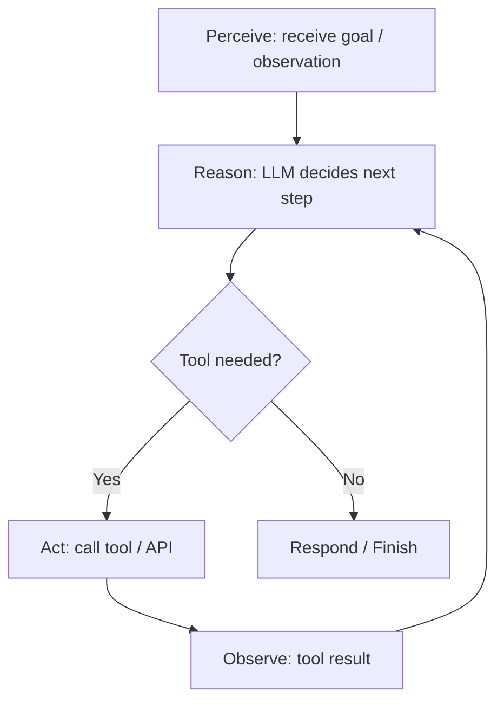
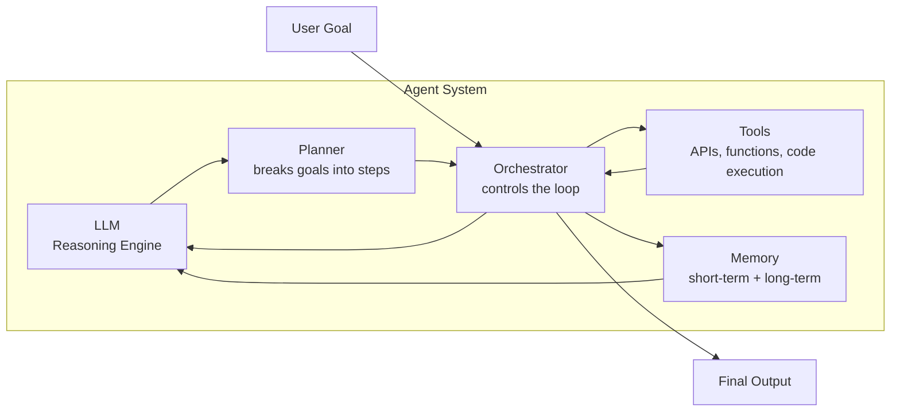
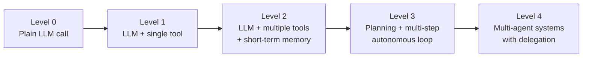

# Day 01 — Introduction to Agentic AI

## 🎯 Learning Objectives

By the end of today you will be able to:

1. Define "agentic AI" precisely and distinguish it from a plain chatbot
2. Explain the perceive → reason → act → observe loop that underlies every agent
3. Identify the core components every agent system has (model, tools, memory, planner, orchestrator)
4. Recognize agentic AI in real products you already use
5. Run your first minimal agent loop in Python

---

## 🧩 Introduction

If you've used ChatGPT, you've used a **language model**. If you've used something like a coding assistant that reads your files, runs your tests, and fixes its own mistakes without you re-prompting it at every step, you've used an **agent**.

The difference matters enormously, and almost the entire rest of this course is about that difference: an agent doesn't just answer — it **acts**, **observes the results of its actions**, and **decides what to do next**, often repeatedly, with no human in the loop between steps.

Agentic AI is the engineering discipline of building systems where a language model is the *reasoning engine* inside a larger loop that can use tools, remember context, plan multi-step work, and correct itself.

---

## 🤔 Why This Matters

Plain LLM calls are stateless and single-shot: prompt in, completion out. That's enough for translation, summarization, or one-off Q&A. It is **not** enough for:

- Booking a flight that requires checking three different sites
- Debugging a failing test suite across multiple files
- Researching a topic, synthesizing 10 sources, and producing a structured report
- Monitoring a system and taking corrective action when something breaks

These tasks require **multiple steps**, **tool use**, **state**, and **decision-making about what to do next** — that's agentic behavior. Companies are hiring specifically for "AI agent engineer" / "agent engineer" roles because this is now its own discipline, distinct from both prompt engineering and classical ML engineering.

---

## 🌍 Real-World Use Cases

| Use Case | What makes it agentic |
|---|---|
| AI coding assistants (e.g., autonomous coding tools) | Reads code, runs commands, observes errors, iterates |
| Customer support agents | Looks up orders, issues refunds via API, escalates conditionally |
| Research assistants | Searches multiple sources, cross-checks facts, compiles a report |
| DevOps/SRE copilots | Monitors logs, diagnoses root cause, opens a fix PR |
| Travel planning agents | Checks flights, hotels, weather, builds a multi-day itinerary |
| Browser automation agents | Navigates websites, fills forms, extracts data |

---

## 🧠 Core Concepts

### 1. The Agent Loop

Every agent, no matter how sophisticated, runs some version of this loop:



This is sometimes called the **OODA loop** (Observe, Orient, Decide, Act) borrowed from military strategy, or simply **"sense-plan-act."** Whatever you call it, the loop is the single most important mental model in this entire course.

### 2. Core Components of an Agent System



| Component | Role | Covered in depth |
|---|---|---|
| LLM | Reasoning, language understanding, decision-making | Day 2–6 |
| Tools | Give the agent the ability to *act* in the world | Day 7–8 |
| Memory | Persist context across steps/sessions | Day 9, 16 |
| Planner | Decompose goals into ordered sub-tasks | Day 11, 13 |
| Orchestrator | The control loop that ties it all together | Day 6, 12 |

### 3. Levels of Agency

Not every system needs full autonomy. It helps to think of a spectrum:



- **Level 0** — a chatbot. No tools, no memory beyond the conversation.
- **Level 1** — an LLM that can call one tool (e.g., a calculator).
- **Level 2** — an LLM with several tools and short-term working memory.
- **Level 3** — the LLM plans ahead, executes multiple steps autonomously, self-corrects.
- **Level 4** — multiple specialized agents collaborate, each with its own tools and role.

Most of this course climbs this ladder one rung at a time.

---

## 💻 Step-by-Step Example: Your First Minimal Agent Loop

We won't use any framework yet — understanding the raw loop matters more than learning an abstraction on Day 1. Frameworks (LangChain, LangGraph) arrive on Day 6+ once you understand what they're abstracting *away*.

### What we're building

A tiny agent that can answer questions, and when it needs to do arithmetic, calls a real Python function instead of "hallucinating" the math.

```python
# code/minimal_agent.py
"""
A minimal agent loop, framework-free.
Demonstrates: perceive -> reason -> act -> observe -> respond
"""

import json
import os
from openai import OpenAI

client = OpenAI(api_key=os.getenv("OPENAI_API_KEY"))

# ---- 1. Define a tool the agent can call ----
def calculator(expression: str) -> str:
    """Safely evaluate a basic arithmetic expression."""
    allowed_chars = set("0123456789+-*/(). ")
    if not set(expression) <= allowed_chars:
        return "Error: invalid characters in expression"
    try:
        return str(eval(expression, {"__builtins__": {}}))
    except Exception as e:
        return f"Error: {e}"


TOOLS = [
    {
        "type": "function",
        "function": {
            "name": "calculator",
            "description": "Evaluate a basic arithmetic expression, e.g. '12 * (3 + 4)'",
            "parameters": {
                "type": "object",
                "properties": {
                    "expression": {
                        "type": "string",
                        "description": "A valid arithmetic expression",
                    }
                },
                "required": ["expression"],
            },
        },
    }
]

AVAILABLE_FUNCTIONS = {"calculator": calculator}


def run_agent(user_goal: str, max_steps: int = 5) -> str:
    """The core agent loop: reason -> act -> observe -> repeat."""
    messages = [
        {
            "role": "system",
            "content": (
                "You are a careful assistant. Use the calculator tool for any "
                "arithmetic instead of computing it yourself."
            ),
        },
        {"role": "user", "content": user_goal},
    ]

    for step in range(max_steps):
        # --- REASON ---
        response = client.chat.completions.create(
            model="gpt-4o-mini",
            messages=messages,
            tools=TOOLS,
        )
        msg = response.choices[0].message

        # --- Did the model decide to ACT? ---
        if msg.tool_calls:
            messages.append(msg)
            for tool_call in msg.tool_calls:
                fn_name = tool_call.function.name
                fn_args = json.loads(tool_call.function.arguments)

                print(f"[step {step}] Agent calls {fn_name}({fn_args})")

                # --- ACT ---
                result = AVAILABLE_FUNCTIONS[fn_name](**fn_args)

                # --- OBSERVE: feed the result back into context ---
                messages.append(
                    {
                        "role": "tool",
                        "tool_call_id": tool_call.id,
                        "content": result,
                    }
                )
            continue  # loop again so the model can use the observation

        # --- No tool call: the agent is done reasoning, return final answer ---
        return msg.content

    return "Max steps reached without a final answer."


if __name__ == "__main__":
    goal = "What is (482 * 17) - 96, and then explain briefly why agents need tools for math?"
    answer = run_agent(goal)
    print("\n--- FINAL ANSWER ---")
    print(answer)
```

### Code Walkthrough

1. **`calculator()`** is a plain Python function — this is the agent's first *tool*. Note the safety guard: we never blindly `eval()` untrusted input in production (more on this in Day 26 — Guardrails).
2. **`TOOLS`** describes the function to the LLM in JSON Schema so the model knows it exists and how to call it.
3. **`run_agent()`** is the loop from our diagram above:
   - **Reason**: ask the LLM what to do next given the conversation so far
   - **Act**: if the LLM requested a tool call, execute the real Python function
   - **Observe**: append the tool's result back into the message history
   - **Repeat** until the LLM responds with plain text (no more tool calls) — that's the terminal condition
4. `max_steps` is a **safety bound** — every agent loop needs one, or a confused agent can loop forever and burn your API budget. This is your first guardrail, and you'll build much more robust versions of it on Day 26.

### Expected Output

```
[step 0] Agent calls calculator({'expression': '(482 * 17) - 96'})

--- FINAL ANSWER ---
(482 × 17) − 96 = 8,098

Agents need tools for math because LLMs predict the most statistically likely
next token, not the result of an exact calculation. For large or precise
arithmetic, an LLM can confidently produce a wrong number. By delegating
calculation to a real calculator function, the agent gets exact correctness
instead of language-model "guessing," while the LLM stays focused on what it's
actually good at: reasoning about language and deciding *when* to use a tool.
```

---

## ✅ Best Practices

- **Always bound your loop.** Use `max_steps` (or a timeout) — never let an agent run unbounded.
- **Keep tools narrow and well-described.** A tool that does one thing with a clear docstring is far more reliable than a vague, multi-purpose one.
- **Never `eval()` raw user/model input** in real systems — our calculator example uses a restricted character set; production code should use `ast.literal_eval` patterns or a proper math parser (e.g., `numexpr`).
- **Log every tool call.** You'll need this for debugging (Day 27 — Observability) from day one of building anything real.
- **Treat the agent loop as a state machine**, not a single function — this mental model scales cleanly all the way to Day 19's multi-agent systems.

## ⚠️ Common Mistakes

- **Confusing "uses an LLM" with "is an agent."** A single prompt-completion call, however clever the prompt, is not an agent — there's no loop, no tool use, no autonomous decision-making.
- **No step limit**, leading to infinite loops and runaway API costs.
- **Putting business logic inside the prompt** instead of inside a tool — e.g., asking the LLM to "calculate the total" rather than giving it a `calculate_total()` function. If correctness matters, compute it in code; let the LLM decide *when* to call that code.
- **Ignoring tool errors.** If `calculator()` returns `"Error: ..."`, the agent needs that fed back as an observation so it can retry or report failure — don't silently swallow exceptions.

## 🎤 Interview Questions

1. What is the fundamental difference between an LLM call and an agent?
2. Describe the perceive-reason-act-observe loop in your own words.
3. Why is a step limit (or other bound) a non-negotiable part of any agent loop?
4. Give an example of a task that requires Level 3 agency (planning + multi-step autonomy) and explain why Level 1 (single tool call) wouldn't suffice.
5. Why shouldn't you ask an LLM to compute exact arithmetic itself instead of calling a tool?

## 🏭 Industry Insights

Production agent systems at companies building coding assistants, customer-support bots, and research tools converge on the same architecture you just built by hand: a control loop, a set of well-scoped tools, structured observations fed back into context, and hard bounds on iteration. The frameworks you'll learn from Day 6 onward (LangGraph, etc.) are productionized versions of exactly this loop — understanding it in raw Python first means you'll never be confused about what a framework is doing "under the hood."

---

## 📌 Summary

- Agentic AI = an LLM embedded in a loop that can act, observe, and decide what to do next
- The core loop is **perceive → reason → act → observe**, repeated until done
- Every agent system is built from some combination of: **LLM, tools, memory, planner, orchestrator**
- Agency exists on a **spectrum (Level 0–4)**, from plain chatbot to multi-agent systems
- You built a minimal, framework-free agent loop with one real tool

---

## 📝 Exercises

See [exercise.md](exercise.md)

## 🧪 Quiz

See [quiz.md](quiz.md)

## 🏆 Challenge

Extend `minimal_agent.py` with a **second tool**, `get_current_year()`, that returns today's year (no arguments). Ask the agent a question that requires *both* tools in sequence (e.g., "How many years until I'm 100, if I was born in 1998, and what is that number times 12?"). Confirm in your printed logs that the agent calls both tools in the correct order.

## 📚 References

- ReAct: Synergizing Reasoning and Acting in Language Models (Yao et al., 2022)
- OpenAI function calling / tool use documentation
- "30 Days of Python" — structural inspiration for this curriculum
